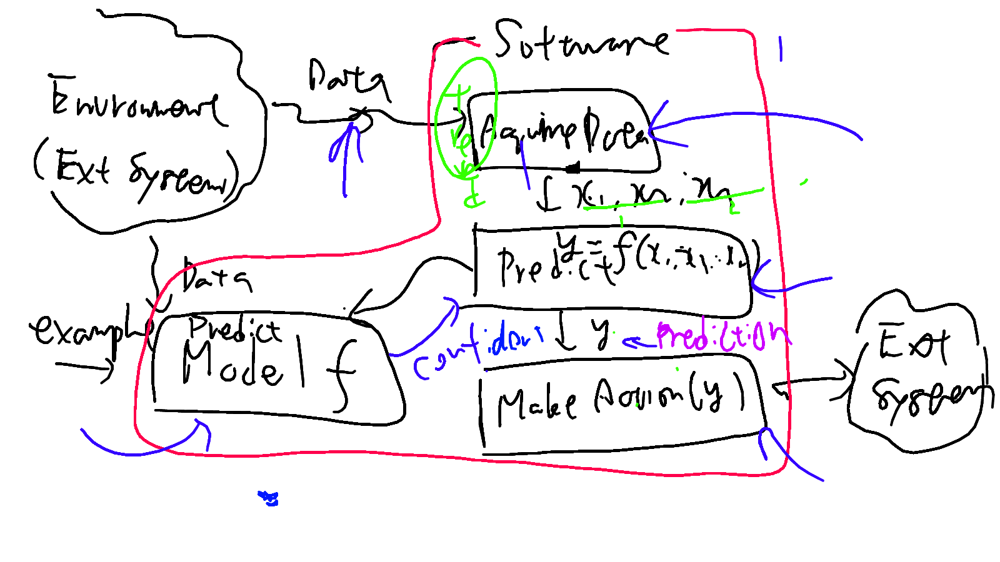

# UGA2019
Repository for Grenoble Projects in 2019

## Members

- Masahide Nakamura (Kobe-U)
- Florian Carrio (UGA)
- Bastien Zigmann (UGA)
- Quentin Guerre-berthelot (UGA)
- Lucas Gisselaire (UGA)
- Lydie du Bousquet (UGA)

## Project Goal

Develop concepts, architectures, and methods that can assure the quality, 
reliablity, and security for __machine-learning-based software (MLSW)__.

## Definition of MLSW
Just for convinience, we first focus on _supervised_ machine learning only.

MLSW is a software _S_ such that:
- _S_ contains a __model__ _M_ derived by a machine-leraning process
- _S_ takes data _D = (d1, d2, ..., dn)_ as an input
- _S_ obtains a prediction _y = M(d1, d2, ..., dn)_ based on the model _M_ and the input data _D_
- _S_ performs a sequence of actions _ACT(y)= [a1(y); a2(y); ... ; an(y)]_ based on the prediction y 

## Approach
1. Consider motivating examples.
1. Investigate risks and threats.
1. Develop methods to cope with the risks and the threats.
1.

### Quentin App (Breast Cancer Diagnosys)
1. Motivation :

	Women Could seen the appearance of cyst in there breast. Those cyst could turned into a cancer or disappeared with time. The thing is that they don't know except if they go to the medic and do some medicals examinations.

	The main goal is, thanks to a machine learning computation, creating a model that recognise, if a breast cyst is benign or malignant, with the caracteristiques of taken cyst's cells.

	For now, the cells are taken by fine needle aspirate (FNA) of a breast mass.
And the caracterics are computed from a digitized image of this needle.

	We can imagine in a near futur a kind of device, that can take and analyse this cells a home and return the cells Features.

	And the woman would be allowed to compute this features in the Application and know instantly the result.
Lyke that they'll know if they need to go see a doctor or juste wate to see how it turned.

2. Risks :

	* The accuracy should be really high :

		If it isn't then in one case, it could only be a false alarm that is not threatening but only scaring. But in the other case it could be really dangerous for the woman thinking that it's not malignant and let the cancer spread without taking action against it.

	* The Web service could shut down :

		The costumer should know that the service is momentarily unavailable.

	* The values entered by the costumer can be wrong

	* Privacy and Cyber-sécurity

3. Coping with the risks

	* Accuracy :

		The data should be regularly analysed and updated, because some occurrence of new values unknowned till now could occured, in this case the app should warned the costumer that the values seems strange and the accurtacy could be lowered. 

		Those  occurrence could be explained, by an wrong entered values by the costumer too, so before any more analyzes it could be good to ask  him if he as not type the wrong value.

	* Connection :

		The easiest way to cop with this risk is to check before sending the values on the web service. And warned the costumer if the service is down.

	* Values entered :

		Few thing should be check : positivs values, Only numbers allowed, all values field.

	* Security :

		For now the url and the Api_key are not transmited the owner of the App should give it to the costumer, but later some system of log in and subscription to the service, could be implemented to create a secure access for the costumer.

### White wine quality prediction (Lucas)
1. Project motivation:

	My idea is to create a model which tries to assign a quality indicator (subjective) to a wine bottle depending on the physical (objective) properties of the bottle. 
	By computing the quality of a given bottle, wine resellers may be able to infer the popularity of said bottle without relying on market studies or other non-automatic models which may very well be both less accurate and more expensive.

2. Risk study:

	While the concept seems interesting on paper, we can easily think of multiple things that can go wrong or induce other problems. Namely:

	* The quality prediction is straight-up wrong:

		While prediction models do use some of the initial data for testing which makes the model more robust, wrong predictions CAN definitely occur because of the model's non-deterministic nature.

	* Input fed to the model is too different from training data:

		Because of the relatively low sample size of the initial dataset (~5000 rows), it is easy to imagine that a bottle fed to the model has physical properties very much different from those of the initial dataset. This disparity may in turn induce a wrong prediction.

	* Web (remote) service is unavailable or compromised:

		The application relies on a remote service to make its predictions; if the service becomes unavailable or compromised, then either no predictions will be able to be made whatsoever, or the predictions will have no value.
		
3. Minimizing the risks:

	Because the model is unpredictable by nature, it is clear that the probability of a problem occuring will never be null; however, I will try looking into ways to minimize the risks I recognized in the last step:

	* Wrong prediction:

		On top of the prediction, a "prediction quality indicator" could be computed to judge the quality of a prediction; for example, a bottle of quality 5.5 with 99% accuracy may be safer/more marketable than a bottle of quality 6.5 with 10% accuracy. All in all, this would probably give more sense & value to a prediction.

	* "Bad" input:

		To prevent users from trying to predict the quality of bottles that the model may not be able to properly handle, I could limit the input to certain pre-determined intervals so as to ensure that the input data is kept in the range of the initial training data. In the same fashion, I could compute a "data ressemblance" factor and only accept inputs within a given range to feed the model.

	* Web service reliance:

		- Warn the user when the service becomes unreachable.
		- Add security mechanisms (key-based encryption & authentification) to ensure that the prediction is reliable.

## Deliverables

- Quentin App : run the script [StartBCancerDiagnosys.sh](./StartBCancerDiagnosys.sh)

- [Application Examples](./examples/)

